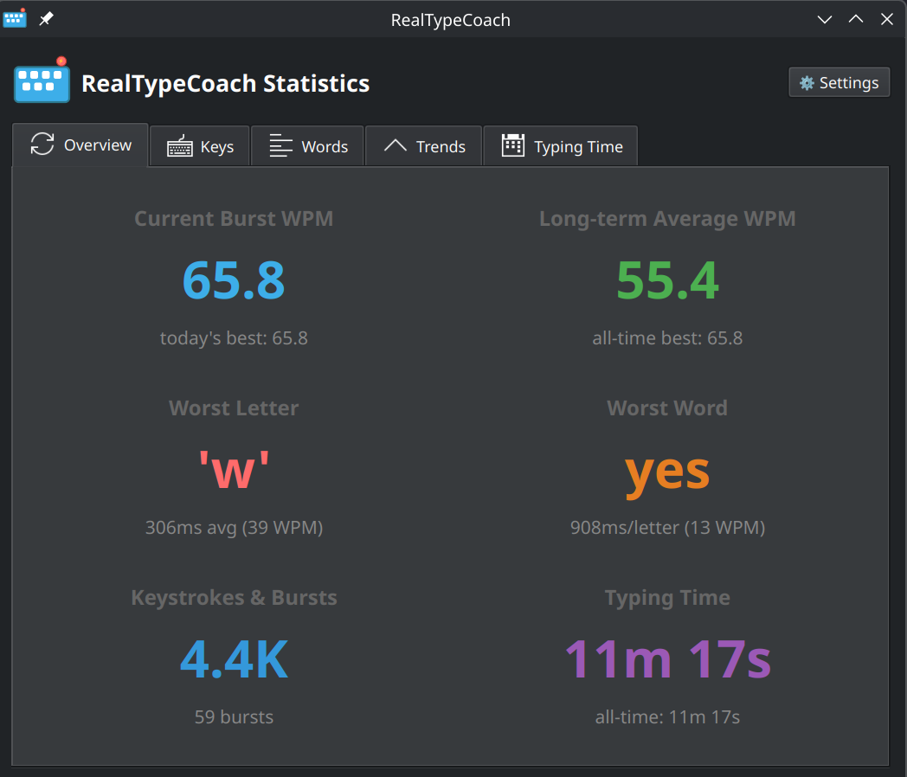

<div align="center">


# RealTypeCoach

**Improve your typing speed naturally by analyzing your real-world typing patterns**

Unlike typing tests that measure artificial performance, RealTypeCoach tracks your daily typing to identify your slowest keys and words, giving you actionable insights to type faster in your actual work.

[](screenshot.png)

</div>

## Features

- ⌨️ **Works silently in the background** - Tracks your natural typing patterns without interrupting your workflow
- 🔒 **Privacy-focused** - Only aggregated statistics are stored (WPM, slowest keys/words) - no keystroke history
- 📊 **Encrypted storage** - Your statistics data stays on your device in an encrypted database
- 📈 **Visualize your progress** - See your WPM improvement over time with interactive charts
- 🔤 **Find your problem words** - Discover which specific words slow you down the most
- 🎯 **Targeted improvement** - Identifies your slowest keys so you can focus practice where it counts

## Requirements

- **Tested on**: Ubuntu 24.04+ with KDE Plasma on Wayland (likely works on other Linux desktops)
- **Python**: 3.10 or higher

See [CONTRIBUTING.md](CONTRIBUTING.md) for compatibility reports.

## Installation

```bash
# 0. Clone or download this repository to a folder
git clone https://github.com/yourusername/realtypecoach.git
cd realtypecoach

# 1. Add your user to the input group (required for keyboard access)
sudo usermod -aG input $USER
# Log out and log back in for this to take effect

# 2. After logging back in, run the installation script
./install.sh
```

The install script installs RealTypeCoach to your home directory (in `~/.local/share/realtypecoach/`) and creates an entry in your application menu. 

> [!NOTE]
> **Why the `input` group?** RealTypeCoach needs to read your keyboard events to analyze typing. Linux restricts this to the `input` group for security. On single-user systems (your laptop/desktop), this is safe and appropriate.

## Usage

The application runs in your system tray:

### System Tray Icon

- **Blue icon**: Monitoring active
- **Orange icon**: Monitoring paused

### Controls

- **Left-click**: Show real-time statistics (current WPM, slowest keys, today's stats)
- **Right-click**: Menu with options
  - Show Statistics
  - Pause/Resume monitoring
  - Settings (burst filter, notification preferences)
  - Quit

### How It Works

1. RealTypeCoach captures keyboard events from `/dev/input/eventX` devices
2. Keystrokes are processed in real-time to detect bursts of continuous typing
3. Only aggregated statistics are stored (WPM, key speeds, word speeds) - **no keystroke history**
4. Statistics are calculated per-key and per-word to identify your slowest patterns
5. Optional daily summary notifications at a configurable time

## Troubleshooting


### "Permission denied: /dev/input/eventX"

Add your user to the input group as notes in the instructions for installation.

### "No keyboard events detected"

1. Check that you're in the input group:

   ```bash
   groups $USER | grep input
   ```

2. List available input devices:

   ```bash
   .venv/bin/python3 -c "from evdev import list_devices; print(list_devices())"
   ```

### "Database encryption key not found"

This error occurs when the keyring cannot access the encryption key. Possible solutions:

1. **Check keyring is unlocked**:

   ```bash
   # For GNOME
   loginctl unlock-session

   # For KDE/KWallet
   kwallet-query -l kdewallet
   ```

2. **Verify keyring backend**:

   ```bash
   python3 -c "import keyring; print(keyring.get_keyring())"
   ```

3. **If all else fails**: Reinitialize (WARNING: This deletes existing data)

   ```bash
   rm ~/.local/share/realtypecoach/typing_data.db
   .venv/bin/python3 -c "from utils.crypto import CryptoManager; from pathlib import Path; c = CryptoManager(Path.home() / '.local' / 'share' / 'realtypecoach' / 'typing_data.db'); c.delete_key()"
   ```

## Uninstallation

```bash
./uninstall.sh
```
This will ask you if you want to keep your data or not.

